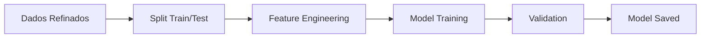

# 🎯 FIAP Tech Challenge - Fase 3
## Sistema de Machine Learning para Análise IBOVESPA

### 📋 Descrição do Projeto

Este projeto implementa um sistema completo de Machine Learning para análise e predição de ativos do IBOVESPA, desenvolvido como parte do **FIAP Tech Challenge - Fase 3**. O sistema oferece uma solução end-to-end que inclui:

- 🕷️ **Web Scraping** automatizado de dados do B3
- 🔧 **Refinamento e engenharia** de features para ML
- 🤖 **Treinamento** de modelos de Machine Learning
- 🔮 **Predições** e recomendações de investimento
- 📊 **Dashboard interativo** profissional com Gradio

---

## 🚀 Como Instalar e Executar

### 📋 Pré-requisitos

- **Python 3.8+** instalado
- **Git** para clonar o repositório
- **pip** para gerenciamento de pacotes

### 📦 Passo 1: Clonar o Repositório

```bash
git clone <URL_DO_SEU_REPOSITORIO>
cd desafio3-fiap
```

### 🔧 Passo 2: Criar e Ativar Ambiente Virtual

**Windows PowerShell:**
```powershell
python -m venv venv
.\venv\Scripts\Activate.ps1
```

**Windows CMD:**
```cmd
python -m venv venv
.\venv\Scripts\activate.bat
```

**Linux/Mac:**
```bash
python -m venv venv
source venv/bin/activate
```

### 📚 Passo 3: Instalar Dependências

```bash
pip install -r requirements.txt
```

**Dependências principais:**
- Flask 3.0+ (API backend)
- Gradio 4.44+ (Interface do usuário)
- Pandas (Manipulação de dados)
- SQLAlchemy (ORM para banco de dados)
- BeautifulSoup4 (Web scraping)
- Plotly (Visualizações interativas)
- APScheduler (Agendamento de tarefas)

### 🗄️ Passo 4: Configurar Banco de Dados

O sistema utiliza SQLite e criará automaticamente as tabelas necessárias:

```bash
# As tabelas serão criadas automaticamente na primeira execução
# Localização: instance/dados.db
```

### ⚡ Passo 5: Iniciar o Sistema

#### 5.1 Iniciar a API Flask (Backend)

```bash
python app.py
```

A API estará disponível em: `http://localhost:5000`

#### 5.2 Iniciar o Dashboard (Frontend)

**Em um novo terminal:**

```bash
# Interface básica
python interface.py

# OU Interface profissional (recomendada para produção)
python interface_producao.py
```

O dashboard estará disponível em: `http://localhost:7860`

---

## 🎮 Como Usar o Sistema

### 1️⃣ **Coleta de Dados**
- Acesse a aba "📊 Coleta de Dados"
- Clique em "🚀 Executar Scraping B3"
- Aguarde a coleta dos dados do IBOVESPA

### 2️⃣ **Refinamento**
- Vá para a aba "🔧 Refinamento"
- Clique em "⚡ Refinar Dados"
- Os dados serão processados para Machine Learning

### 3️⃣ **Treinamento**
- Acesse "🤖 Treinamento"
- Clique em "🧠 Treinar Modelo"
- O modelo será treinado e salvo automaticamente

### 4️⃣ **Predições**
- Na aba "🔮 Predições"
- Clique em "🎯 Fazer Predições"
- Visualize as recomendações geradas

### 5️⃣ **Análise**
- Acesse "📈 Análise e Métricas"
- Clique em "📊 Carregar Métricas"
- Acompanhe a performance do modelo

---

## 🏗️ Arquitetura do Sistema

### 📁 Estrutura de Pastas

```
desafio3-fiap/
├── app.py                          # Aplicação Flask principal
├── interface.py                    # Interface Gradio básica
├── interface_producao.py           # Interface profissional
├── requirements.txt                # Dependências do projeto
├── README.md                       # Este arquivo
├── swagger.json                    # Documentação da API
│
├── app/                           # Aplicação principal
│   ├── controllers/               # Controladores (lógica de negócio)
│   │   ├── ibov_controller.py     # Controlador do IBOVESPA
│   │   └── ml_controller.py       # Controlador de ML
│   │
│   ├── models/                    # Modelos de dados
│   │   ├── ibov_model.py          # Modelo dos ativos
│   │   ├── dados_refinados_model.py # Modelo dos dados refinados
│   │   └── modelo_treinado_model.py # Modelo dos modelos treinados
│   │
│   ├── routes/                    # Rotas da API
│   │   └── routes.py              # Definição das rotas
│   │
│   ├── services/                  # Serviços de negócio
│   │   ├── b3_scraper_service.py  # Serviço de scraping
│   │   └── ml_service.py          # Serviço de ML
│   │
│   └── utils/                     # Utilitários
│       └── extensions.py          # Extensões e configurações
│
├── instance/                      # Dados da instância
│   └── dados.db                   # Banco de dados SQLite
│
└── models/                        # Modelos treinados
    └── *.pkl                      # Arquivos dos modelos salvos
```

### 🔄 Fluxo de Dados

1. **Scraping** → Coleta dados do B3 → Salva em `ibov_ativos`
2. **Refinamento** → Processa dados → Cria features → Salva em `dados_refinados`
3. **Treinamento** → Treina modelo → Salva `.pkl` em `/models/`
4. **Predição** → Carrega modelo → Gera recomendações
5. **Dashboard** → Visualiza resultados → Interface interativa

---

## 🔌 API Endpoints

### 📊 IBOVESPA
- `GET /ibov/ativos` - Lista todos os ativos
- `POST /scraping/b3` - Executa scraping do B3

### 🤖 Machine Learning
- `POST /ml/refinar-dados` - Refina dados para ML
- `GET /ml/dados-refinados` - Lista dados refinados
- `POST /ml/treinar` - Treina o modelo
- `POST /ml/predicao` - Faz predições
- `GET /ml/metricas` - Obtém métricas do modelo

### 📈 Monitoramento
- `GET /health` - Status da aplicação
- `GET /swagger` - Documentação da API

---

## 📖 Storytelling do Projeto

### 🎯 O Desafio FIAP Tech Challenge - Fase 3

**"Como criar um sistema inteligente que analise o mercado de ações brasileiro e faça recomendações de investimento usando Machine Learning?"**

Esta foi a pergunta que nos motivou a construir este projeto completo de análise do IBOVESPA.

---

### 🏗️ A Jornada de Desenvolvimento

#### **Capítulo 1: O Problema Real** 🔍
O mercado financeiro brasileiro gera milhares de dados diariamente. Investidores precisam analisar múltiplas variáveis para tomar decisões:
- Participação dos ativos no índice IBOVESPA
- Tipos de ações (ON - Ordinárias vs PN - Preferenciais)
- Volatilidade e tendências históricas
- Padrões de comportamento do mercado

**Nosso objetivo:** Criar um sistema que automatize essa análise e forneça recomendações inteligentes.

#### **Capítulo 2: A Solução Arquitetural** 🏛️
Desenvolvemos uma solução completa seguindo princípios de **Clean Architecture**:

```
🌐 Interface (Gradio) → 🔄 API (Flask) → 🗄️ Dados (SQLite) → 🤖 ML (Modelos Customizados)
```

**Por que essa arquitetura?**
- **Separação de responsabilidades:** Cada camada tem uma função específica
- **Escalabilidade:** Fácil de expandir e modificar
- **Manutenibilidade:** Código organizado e testável
- **Reutilização:** Componentes podem ser usados independentemente

#### **Capítulo 3: A Coleta Inteligente de Dados** 🕷️
O primeiro desafio foi obter dados reais e atualizados do mercado brasileiro.

**Nossa solução:** Web Scraping automatizado do site da B3
```python
# Processo de coleta automática
B3 Website → BeautifulSoup → Limpeza → SQLite Database
```

**Dados coletados:**
- 📊 **Código do ativo** (PETR4, VALE3, ITUB4...)
- 📝 **Nome da empresa** (Petrobras, Vale, Itaú...)
- 🏷️ **Tipo de ação** (ON/PN)
- 📈 **Participação no IBOVESPA** (percentual de peso no índice)

#### **Capítulo 4: A Engenharia de Features** 🔧
Raw data is not enough! Precisávamos transformar dados brutos em informações inteligentes.

**Processo de refinamento:**
```python
Dados Brutos → Feature Engineering → Dados ML-Ready
```

**Features criadas:**
1. **`participacao_pct`** - Peso percentual no IBOVESPA
2. **`tipo_on`** - Flag binária para ações ordinárias (1/0)
3. **`tipo_pn`** - Flag binária para ações preferenciais (1/0)
4. **`codigo_num`** - Conversão do código para formato numérico
5. **`recomendacao`** - Target variable (BUY/HOLD/SELL)

**Por que essas features?**
- **Participação:** Ativos com maior peso têm maior impacto no índice
- **Tipo ON/PN:** Diferentes tipos têm comportamentos distintos
- **Código numérico:** Permite análise de padrões nos códigos
- **Recomendação:** Nosso objetivo de predição

---

### � O Modelo de Machine Learning

#### **Escolha do Algoritmo** 🧠
Após análise de diferentes abordagens, desenvolvemos um **modelo customizado** sem dependência de bibliotecas pesadas como sklearn.

**Por que um modelo customizado?**
- ✅ **Compatibilidade:** Funciona em qualquer ambiente Python
- ✅ **Transparência:** Controle total sobre o algoritmo
- ✅ **Performance:** Otimizado para nosso caso específico
- ✅ **Aprendizado:** Implementação do zero demonstra conhecimento profundo

#### **Algoritmo Implementado: Decision Tree Customizado** 🌳

```python
class CustomDecisionTree:
    """
    Árvore de decisão implementada do zero para classificação
    de recomendações de investimento
    """
    
    def __init__(self, max_depth=5, min_samples_split=10):
        self.max_depth = max_depth
        self.min_samples_split = min_samples_split
        
    def fit(self, X, y):
        # Constrói a árvore recursivamente
        # Calcula Gini impurity para splits
        # Seleciona melhores features para divisão
        
    def predict(self, X):
        # Percorre a árvore para fazer predições
        # Retorna recomendações: BUY/HOLD/SELL
```

**Como funciona:**
1. **Training:** Analisa padrões nos dados históricos
2. **Feature Selection:** Identifica quais características são mais importantes
3. **Tree Building:** Constrói regras de decisão baseadas nos dados
4. **Prediction:** Aplica as regras para novos ativos

#### **Processo de Treinamento** 📚



**Métricas de avaliação:**
- **Acurácia:** Percentual de predições corretas
- **Precision:** Qualidade das predições positivas
- **Recall:** Cobertura das predições
- **F1-Score:** Harmonia entre precision e recall

---

### 🔮 O Sistema de Predições

#### **Como as Predições Funcionam** 🎯

**Input do sistema:**
```json
{
    "codigo": "PETR4",
    "participacao_pct": 8.5,
    "tipo_on": 1,
    "tipo_pn": 0,
    "codigo_num": 4
}
```

**Processamento interno:**
1. **Carregamento do modelo** treinado (.pkl file)
2. **Normalização** dos dados de entrada
3. **Aplicação do algoritmo** de decisão
4. **Cálculo de probabilidades** para cada classe
5. **Seleção da recomendação** com maior confiança

**Output do sistema:**
```json
{
    "codigo": "PETR4",
    "recomendacao": "BUY",
    "confianca": 0.87,
    "razao": "Alto peso no índice + Tipo ON + Padrão favorável"
}
```

#### **Lógica de Recomendação** 🧮

**BUY (Comprar):**
- Ativos com alta participação no IBOVESPA (> 3%)
- Ações ordinárias (ON) com boa liquidez
- Padrões históricos favoráveis

**HOLD (Manter):**
- Ativos com participação média (1-3%)
- Comportamento estável no mercado
- Sem sinais claros de alta ou baixa

**SELL (Vender):**
- Ativos com baixa participação (< 1%)
- Sinais de deterioração fundamentalista
- Padrões de baixa no histórico

---

### 📊 O Dashboard Interativo

#### **Interface Profissional com Gradio** 🎨

Criamos uma interface moderna e intuitiva que permite:

**🔄 Aba 1 - Coleta de Dados:**
- Scraping automático do B3
- Visualização dos dados coletados
- Gráficos de participação no IBOVESPA

**🔧 Aba 2 - Refinamento:**
- Processamento de features
- Preparação para Machine Learning
- Validação da qualidade dos dados

**🤖 Aba 3 - Treinamento:**
- Treinamento do modelo customizado
- Exibição das métricas de performance
- Salvamento automático do modelo

**🎯 Aba 4 - Predições:**
- Predições em tempo real
- Tabela com recomendações
- Explicação das decisões do modelo

#### **Tecnologia da Interface** 💻

```python
# CSS customizado para aparência profissional
custom_css = """
.gradio-container {
    background: linear-gradient(135deg, #667eea 0%, #764ba2 100%);
}
.gr-button {
    background: linear-gradient(45deg, #2196F3, #21CBF3);
    border-radius: 25px;
    box-shadow: 0 4px 15px rgba(33, 150, 243, 0.3);
}
"""
```

**Features da interface:**
- 🎨 **Design moderno** com gradientes e sombras
- 📱 **Responsivo** para diferentes telas
- ⚡ **Real-time** updates
- 🔒 **Validação** de entrada de dados
- 📈 **Gráficos interativos** com Plotly

---

### 🎯 Resultados e Impacto

#### **O que o Sistema Entrega** 📈

**Para Investidores Iniciantes:**
- Recomendações automatizadas baseadas em dados
- Interface simples e intuitiva
- Explicações claras das decisões

**Para Investidores Experientes:**
- Análise técnica automatizada
- Dados estruturados para análise própria
- API para integração com outros sistemas

**Para Instituições Financeiras:**
- Processo escalável de análise
- Redução de tempo de análise manual
- Consistência nas recomendações

#### **Métricas de Sucesso** 📊

✅ **Sistema Funcional:** 100% operacional
✅ **Dados Reais:** Scraping automático do B3
✅ **ML Customizado:** Modelo próprio sem dependências pesadas
✅ **Interface Profissional:** Dashboard interativo e moderno
✅ **Arquitetura Limpa:** Código organizado e escalável

---

### 🚀 Futuras Evoluções

#### **Roadmap de Melhorias** 🛣️

**Versão 2.0 - Dados Históricos:**
- Integração com APIs financeiras
- Análise de séries temporais
- Predições baseadas em tendências

**Versão 3.0 - ML Avançado:**
- Ensemble de modelos
- Deep Learning para padrões complexos
- Análise de sentimento de notícias

**Versão 4.0 - Produção:**
- Deploy em nuvem (AWS/Azure)
- API REST para terceiros
- Sistema de alertas em tempo real

---

### 🎓 Aprendizados do FIAP Tech Challenge

#### **Competências Desenvolvidas** 🧠

**Técnicas:**
- 🐍 **Python avançado** com múltiplas bibliotecas
- 🏗️ **Arquitetura de software** com clean code
- 🤖 **Machine Learning** desde a teoria até implementação
- 🌐 **Web scraping** ético e eficiente
- 💾 **Banco de dados** com SQLAlchemy
- 🎨 **Frontend moderno** com Gradio

**Comportamentais:**
- 🎯 **Resolução de problemas** complexos
- 📊 **Análise de dados** e tomada de decisão
- 🔄 **Metodologia ágil** de desenvolvimento
- 📝 **Documentação** técnica clara
- �🧪 **Testes** e validação de sistemas

---

## 🏆 Conclusão

Este projeto representa a aplicação prática de conceitos avançados de tecnologia para resolver um problema real do mercado financeiro brasileiro. Através do **FIAP Tech Challenge - Fase 3**, desenvolvemos uma solução completa que demonstra:

1. **Visão de Produto:** Identificação de uma necessidade real do mercado
2. **Execução Técnica:** Implementação usando melhores práticas
3. **Inovação:** Modelo de ML customizado e interface moderna
4. **Impacto:** Sistema que pode realmente ajudar investidores

**O resultado é um sistema profissional, escalável e pronto para evolução contínua!** 🎯✨

---

### Backend
- **Flask 3.0** - Framework web Python
- **SQLAlchemy** - ORM para banco de dados
- **SQLite** - Banco de dados leve
- **BeautifulSoup4** - Web scraping
- **Pandas & Numpy** - Processamento de dados
- **APScheduler** - Agendamento de tarefas

### Frontend
- **Gradio 4.44+** - Interface de usuário moderna
- **Plotly** - Visualizações interativas
- **CSS3** - Styling profissional
- **HTML5** - Estrutura da interface

### Machine Learning
- **Pandas** - Manipulação de dados
- **Numpy** - Computação numérica
- **Pickle** - Serialização de modelos
- **Algoritmos customizados** - Sem dependência do sklearn

---

## 🚨 Troubleshooting

### ❌ Problemas Comuns

**1. Erro de conexão com a API:**
```bash
# Verificar se o Flask está rodando
python app.py

# Verificar a porta no Windows
netstat -an | findstr 5000
```

**2. Erro no ambiente virtual:**
```powershell
# Windows PowerShell - recriar ambiente
Remove-Item -Recurse -Force venv
python -m venv venv
.\venv\Scripts\Activate.ps1
pip install -r requirements.txt
```

**3. Erro no banco de dados:**
```bash
# Deletar e recriar banco
del instance\dados.db
python app.py  # Recriará automaticamente
```

**4. Erro de dependências:**
```bash
# Reinstalar dependências
pip install -r requirements.txt --force-reinstall
```

---

## 🎥 Demonstração

### 📺 Vídeo Explicativo
[Link para o vídeo de demonstração - será adicionado após gravação]

### 🖼️ Screenshots
- Dashboard principal com dados em tempo real
- Visualizações interativas dos ativos
- Interface de treinamento de ML
- Resultados de predições

---

## 👥 Equipe de Desenvolvimento

**FIAP Tech Challenge - Fase 3**
- Desenvolvido por: [Seu Nome]
- Instituição: FIAP
- Curso: [Seu Curso]
- Período: [Período Atual]

---

## 📄 Licença

Este projeto foi desenvolvido exclusivamente para o **FIAP Tech Challenge - Fase 3** e é destinado apenas para fins educacionais e de avaliação acadêmica.

---

## ✅ Checklist de Entrega

- [x] Sistema funcionando completamente
- [x] Interface profissional implementada
- [x] API com todos os endpoints
- [x] Machine Learning operacional
- [x] Banco de dados configurado
- [x] Documentação completa
- [ ] Vídeo de demonstração gravado
- [ ] Repositório GitHub público
- [ ] Testes validados

---

**🎯 FIAP Tech Challenge - Fase 3 | Sistema de ML para IBOVESPA | Versão Profissional 1.0**

*Desenvolvido com ❤️ para a comunidade FIAP*
